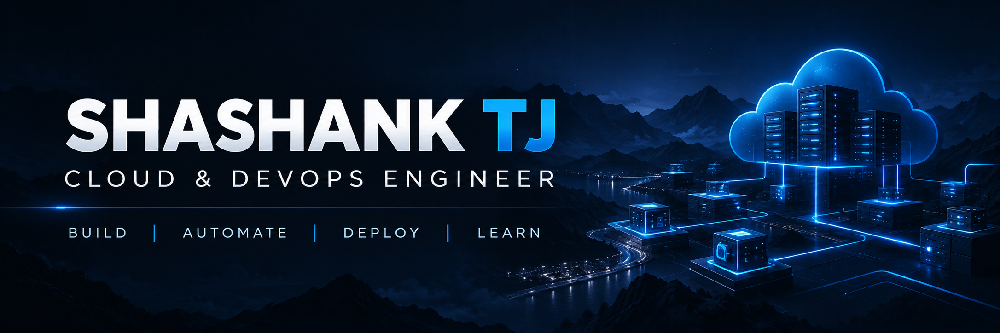

  

Building cloud infrastructure, automation, containerized applications, and CI/CD pipelines.

 

---

## About Me

I am a Cloud and DevOps-focused engineer interested in building reliable, automated, and production-oriented infrastructure.

My work focuses on cloud infrastructure, Linux administration, Infrastructure as Code, containerization, CI/CD, and automation.

I enjoy turning infrastructure concepts into hands-on projects and continuously improving my skills through practical implementation.

---

## Technical Skills

<table>
<tr>

<td width="25%" align="center" valign="top">

<h3>Cloud & Infrastructure</h3>

  

<b>AWS</b> 
EC2 · VPC · IAM · S3 
Lambda · API Gateway 
CloudFront · Route 53 
DynamoDB · RDS · CloudWatch

</td>

<td width="25%" align="center" valign="top">

<h3>DevOps & Automation</h3>

  

<b>DevOps Tools</b> 
Docker · Kubernetes 
Ansible · Git · GitHub 
GitHub Actions 
CI/CD Automation

</td>

<td width="25%" align="center" valign="top">

<h3>Linux & Scripting</h3>

  

<b>System Administration</b> 
Linux · Ubuntu 
Bash Scripting 
SSH · Users & Permissions 
Processes · Monitoring

</td>

<td width="25%" align="center" valign="top">

<h3>Development</h3>

  

<b>Programming</b> 
Python 
HTML · CSS · JavaScript 
Automation Scripts 
Application Development

</td>

</tr>
</table>

---

## Featured Projects

<table>
<tr>

<td width="50%" valign="top">

<h3>Enterprise Infrastructure Platform</h3>

Production-oriented AWS infrastructure built with Terraform, focusing on automation, Linux, containers, monitoring, security, and CI/CD.

 

  

<code>AWS</code>
<code>Terraform</code>
<code>Linux</code>
<code>Docker</code>
<code>Kubernetes</code>

  

<a href="YOUR_PROJECT_LINK">View Project →</a>

</td>

<td width="50%" valign="top">

<h3>Production Linux Server Administration & Automation</h3>

Hands-on Linux server administration focused on configuration, automation, monitoring, SSH, users, permissions, and operational practices.

 

  

<code>Linux</code>
<code>Ubuntu</code>
<code>Bash</code>
<code>Ansible</code>

  

<a href="YOUR_PROJECT_LINK">View Project →</a>

</td>

</tr>

<tr>

<td width="50%" valign="top">

<h3>Production CI/CD Pipeline with Docker</h3>

Automated application delivery using GitHub Actions, Docker, and Amazon ECR.

 

  

<code>GitHub Actions</code>
<code>Docker</code>
<code>AWS ECR</code>
<code>CI/CD</code>

  

<a href="YOUR_PROJECT_LINK">View Project →</a>

</td>

<td width="50%" valign="top">

<h3>Serverless Cloud Resume Platform</h3>

Serverless resume platform built with AWS and Terraform, including static hosting, CDN, DNS, API, visitor counter, and database.

 

<code>S3</code>
→
<code>CloudFront</code>
→
<code>Route 53</code>

  

<code>API Gateway</code>
→
<code>Lambda</code>
→
<code>DynamoDB</code>

  

<a href="YOUR_PROJECT_LINK">View Project →</a>

</td>

</tr>

<tr>

<td width="50%" valign="top">

<h3>Emotion Recognition Using Deep Learning</h3>

Deep learning project for facial emotion recognition using FER2013, image classification, and computer vision.

 

  

<code>Python</code>
<code>TensorFlow</code>
<code>Keras</code>
<code>OpenCV</code>

  

<a href="YOUR_PROJECT_LINK">View Project →</a>

</td>

<td width="50%" valign="top">

<h3>CloudVault</h3>

Personal cloud storage and file management platform built around UGREEN NAS infrastructure with controlled storage access and administration.

  

<code>UGREEN NAS</code>
<code>Cloud Storage</code>
<code>Linux</code>
<code>Networking</code>

  

<a href="YOUR_PROJECT_LINK">View Project →</a>

</td>

</tr>
</table>

---

## Cloud & DevOps Focus

<table>
<tr>

<td align="center" width="16%">

  

<b>Cloud</b>

 

AWS Infrastructure

</td>

<td align="center" width="16%">

<h2>→</h2>

</td>

<td align="center" width="16%">

  

<b>Infrastructure</b>

 

Terraform / IaC

</td>

<td align="center" width="16%">

<h2>→</h2>

</td>

<td align="center" width="16%">

  

<b>Systems</b>

 

Linux / Containers

</td>

<td align="center" width="16%">

<h2>→</h2>

</td>

<td align="center" width="16%">

  

<b>DevOps</b>

 

CI/CD / Kubernetes

</td>

</tr>
</table>

 

<b>Cloud Infrastructure → Infrastructure as Code → Linux → Containers → CI/CD → Operations</b>

My current focus is building practical projects that combine these areas into complete, automated, and deployable systems.

---

## Currently Working On

<table>
<tr>

<td width="50%" valign="top">

### Cloud & Infrastructure

- AWS Cloud Infrastructure
- Terraform Infrastructure as Code
- Linux Server Administration
- Ansible Configuration Management
- Cloud Architecture

</td>

<td width="50%" valign="top">

### DevOps & Automation

- Docker & Containerization
- GitHub Actions
- CI/CD Automation
- AWS ECR
- Kubernetes
- Infrastructure Automation

</td>

</tr>
</table>

<b>Building practical cloud and DevOps projects through hands-on implementation.</b>

---

## Connect With Me

  

**Building. Automating. Learning.**

